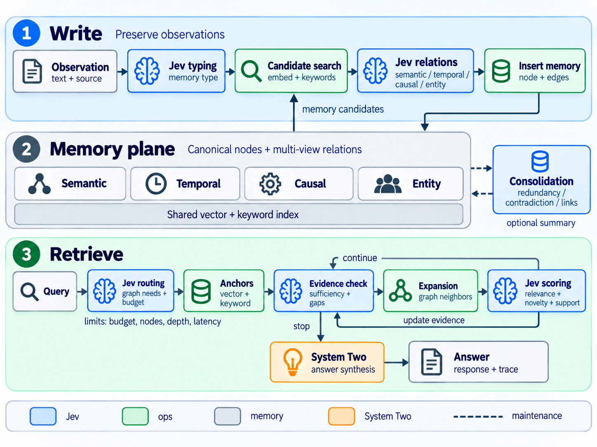

# Jev-Mem

**Typed probabilistic control for multi-graph conversational memory.**

Jev-Mem uses [TypeSafe Jev](https://docs.typesafe.ai/) to guide how an agent
constructs and searches memory. Jev returns typed decisions through **Noul**
(binary propositions) and **Choice** (categorical decisions). Ordinary code
validates those decisions, maintains the graph, and enforces retrieval budgets.
A separate language model generates the final answer from retrieved evidence.




[Algorithm design](docs/algorithm.md) · [Implementation](docs/implementation.md) ·
[Evaluation](docs/evaluation.md) · [Contributing](CONTRIBUTING.md)

## What it does

- **Preserves observations:** admission filtering is off by default. Writes retain
  original text and provenance, attach overlapping memory-type scores, and add
  semantic, temporal, causal, and entity relations.
- **Retrieves with bounded work:** vector and keyword anchors seed graph traversal;
  Jev guides graph budgets, candidate ranking, and evidence-based stopping.
- **Makes decisions inspectable:** traces record decisions, budgets, cache hits,
  stopping reasons, and fallback events. API failures have explicit fallback behavior.
- **Supports controlled experiments:** separate write/read ablations, validated
  configuration files, cache reuse, and an offline mock demo.

## Quick start

Python **3.11+** is required; 3.11 is the recommended starting point. Run these
commands from the repository root after cloning or extracting the source:

```bash
python3.11 -m venv .venv
source .venv/bin/activate
python -m pip install -r requirements.txt
python jev_mem_demo.py
```

The demo needs **no API keys or model downloads**. It uses deterministic mock
Jev decisions and embeddings, saves a small graph under `jev_mem_cache/demo`,
and prints retrieved evidence and its trace. It demonstrates execution, not
answer quality. Dependencies must already be installed to run offline.

For development, install `requirements-dev.txt` and run `python -m pytest -q`.
Alternatively, `bash setup.sh` creates the environment and installs development
dependencies. Windows users can activate with `.venv\Scripts\Activate.ps1`.

## Configure live providers

```bash
cp .env.example .env
```

Fill in your **local** `.env`:

```dotenv
TYPESAFE_API_KEY=
TYPESAFE_DEFAULT_MODEL=jev-latest
OPENAI_API_KEY=
```

`TYPESAFE_API_KEY` authenticates Jev decisions. `OPENAI_API_KEY` authenticates
answer generation and evaluation. Paste raw keys without a `Bearer` prefix.
The CLI loads `.env`; existing environment variables take precedence.

For Azure OpenAI v1, use your Azure resource key as `OPENAI_API_KEY` and set:

```dotenv
OPENAI_BASE_URL=https://YOUR-RESOURCE.services.ai.azure.com/openai/v1/
```

Pass your chat deployment name with `--model`. The default `minilm` embedding
backend downloads a sentence-transformer model on first use. To use the OpenAI
embedding backend, see the deployment variables in [.env.example](.env.example).

Live runs send text to the configured providers and can incur charges. `.env`,
datasets, memory caches, and results are excluded from public distribution.
Read [SECURITY.md](SECURITY.md) before using private conversations.

## Run LoCoMo

Obtain the dataset from the [official LoCoMo repository](https://github.com/snap-research/locomo)
and save it as `data/locomo10.json`; see [data setup](data/README.md).
The repository includes only original [synthetic examples](examples/README.md).

Start with ten questions from sample 0:

```bash
python test_fixed_memory.py \
  --dataset data/locomo10.json \
  --jev-config config/jev_mem.json \
  --sample 0 --model gpt-4o-mini \
  --max-questions 10 --category-to-test 1,2,3,4 --best-of-n 1
```

Run samples **2 through 5** in one invocation:

```bash
python test_fixed_memory.py \
  --jev-config config/jev_mem.json \
  --sample 2 3 4 5 --model gpt-4o-mini \
  --max-questions 10000 --category-to-test 1,2,3,4 --best-of-n 1
```

Samples are zero-based positions. `--max-questions` caps questions **per sample**
after category filtering; it does not limit conversation ingestion. A large cap
runs all eligible questions. Samples run sequentially, with parallel questions
inside each sample; add `--no-parallel` for sequential questions.

Use `--best-of-n 1` for single-answer evaluation. The inherited default is 3,
and reference-aware selection can bias reported accuracy. Category 5 requires
separate adversarial analysis. See [evaluation guidance](docs/evaluation.md).
`--jev-mock` replaces Jev only: the benchmark still uses live answer generation
and judging. Use the demo for a fully offline run.

### Cache reuse and reconstruction

Identical sample, model, embedding, and configuration settings reuse a saved
graph automatically. The runner prints the resolved cache directory. Read and
write settings contribute to its fingerprint.

- Add `--rebuild` to reconstruct memory and replace that run's saved graph.
- Add `--cache-dir ./jev_mem_cache/new-experiment` to preserve older runs.
- For one sample, add `--reuse-memory PATH_TO_EXISTING_SAMPLE_CACHE` to reuse
  an exact graph while tuning retrieval. Construction settings must match;
  new logs and results use the new configuration. Do not combine with `--rebuild`.

The rename gives new runs `jev_mem_…` paths. Existing `sys1mem_…` caches can be
loaded explicitly through `--reuse-memory`; both old and new saved-config
filenames are accepted. Never load an untrusted cache.

## Configuration and API

The active live profile is [config/jev_mem.json](config/jev_mem.json). Validated
fields and baseline defaults live in [JevMemConfig](memory/jev_mem_config.py).
The alternate `jev_mem_accuracy.json` is an earlier retrieval experiment, not
an established improvement over the main profile.

| Main profile setting | Value | Purpose |
| --- | ---: | --- |
| `admission_enabled` | `false` | Keep every valid observation |
| `candidate_top_k` | 10 | Bound relation candidates per write |
| `relation_threshold` | 0.60 | Accept sufficiently supported relations |
| `anchor_count` | 30 | Seed retrieval from hybrid search |
| `answer_top_k` / `multihop_top_k` | 40 / 50 | Limit evidence passed to the answerer |
| `total_graph_budget` | 80 | Limit graph expansion allocations |
| `maximum_nodes` / `maximum_edges` | 60 / 2400 | Bound traversal work |
| `maximum_jev_calls` | 16 | Bound retrieval network attempts |

These are experimental settings. Tune on development samples and evaluate on
held-out samples. Latency limits are checked between operations, not a strict
wall-clock guarantee for synchronous local computation.

Build and query your own observations with the same configuration:

```bash
python main.py --mode build --input examples/observations.json \
  --jev-config config/jev_mem.json --cache-dir ./jev_mem_cache/app
python main.py --mode query --question "What reminder does Mira prefer?" \
  --jev-config config/jev_mem.json --cache-dir ./jev_mem_cache/app
```

Python entry points are `main.JevMemSystem`, `memory.JevMemConfig`,
`memory.MemoryBuilder`, and `memory.QueryEngine`. Constructors accept
`jev_config=...`. Jev questions live in [memory/jev_questions.py](memory/jev_questions.py).
See [implementation details](docs/implementation.md) for library usage and SDK calls.

Omit the Jev configuration and flags to use the MAGMA baseline. With Jev enabled,
`--no-jev-write` and `--no-jev-read` ablate either controller. The previous
`--sys1mem`, `--sys1-config`, and `--no-sys1-*` flags and Python imports remain
compatibility aliases. Some saved metadata retains legacy names for old graphs.

## Repository guide

| Path | Contents |
| --- | --- |
| `memory/` | Graph/vector storage, Jev policies, retrieval, generation and scoring |
| `config/` | Live experimental configuration profiles |
| `tests/` | Offline regression and SDK contract tests |
| `examples/` | Original synthetic inputs |
| `docs/` | Algorithm draft, implementation, evaluation, and release guidance |
| `docs/figures/` | Overview figure, Mermaid source, and Python renderer |
| `scripts/` | Anchor diagnostics and public-release checks/export |
| `.github/` | CI, issue forms, dependency updates, and PR template |

The separate LongMemEval runner retains the upstream baseline; Jev-Mem control
is not integrated into it. Current work includes held-out evaluation, probability
calibration, and validation under live provider load. Mock tests do not answer
those research questions.

## Contributing, citation, and license

See [CONTRIBUTING.md](CONTRIBUTING.md), [the code of conduct](CODE_OF_CONDUCT.md),
[security guidance](SECURITY.md), and [the changelog](CHANGELOG.md).
To prepare a clean public checkout from a private workspace, use
[the release guide](docs/releasing.md).

A minimal development-software citation is in [CITATION.bib](CITATION.bib).
For research, record the actual commit and cite the upstream MAGMA work and
any datasets used. Author, repository, and archival identifiers should be added
when the release owner supplies them; no paper publication is claimed here.

Distributed under the [MIT license](LICENSE). The original MAGMA license and
copyright notice are preserved; see [NOTICE](NOTICE) for attribution. External
services, dependencies, and datasets retain their respective terms.
