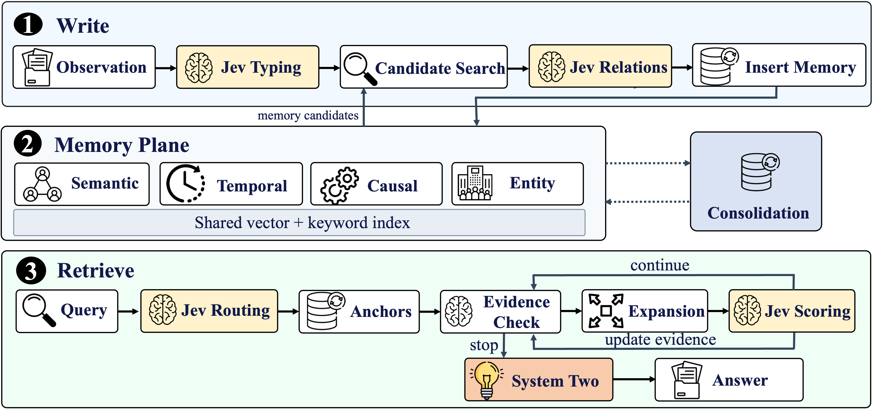

# Jev-Mem: System-One Controlled Agentic Memory

**Better memory for long-running AI agents—with fast decisions and focused reasoning.**

Jev-Mem separates the frequent decisions of memory management from the deeper
reasoning needed to answer a question. A lightweight **System-One controller**
organizes memories and guides retrieval across semantic, temporal, causal, and
entity relations. A **System-Two language model** synthesizes the answer from
the evidence it finds.

On LoCoMo with **GPT-4o-mini**, the paper reports **11.0% higher overall answer
quality**, **6.6× faster memory construction**, and **36.7% lower query latency**
than the strongest or fastest baseline for each metric. See [results](#results-on-locomo)
for the comparisons.

[Results](#results-on-locomo) · [How it works](#how-it-works) ·
[Quick start](#quick-start) · [Run experiments](#run-experiments) ·
[Contribute](#contributing) · [Citation](#citation)



##  Why Jev-Mem?

Persistent agents need to remember preferences, connect events across sessions,
and recover the right evidence as their histories grow. Each new memory and
each retrieval step introduces decisions: how information connects, where to
search, and when enough evidence has been found. Jev-Mem gives these decisions
a dedicated, structured controller.

- **Preserve the evidence.** Keep original observations, timestamps, and provenance.
  The default profile retains every valid observation, so a detail can become
  useful later even if its importance was unclear when it arrived.
- **Connect memories in four ways.** Shared memory nodes participate in semantic,
  temporal, causal, and entity graph views, supporting questions about what
  happened, when, why, and to whom.
- **Adapt retrieval to the question.** Route queries across relevant graph views,
  allocate search budgets, score candidates, and reassess whether more evidence
  is needed after each round.
- **Inspect the decisions.** Typed outputs, explicit traversal limits, and traces
  expose routing, budgets, stopping reasons, cache hits, and fallback events.


## Results on LoCoMo

Results below are reported in **Tables 1–2 of the current paper,
*Jev-Mem: System-One Controlled Agentic Memory***, using GPT-4o-mini as the answer
model. Answer quality is measured by LLM-as-a-Judge; query latency includes
retrieval and answer generation.

| Method | Overall score ↑ | Memory build time (s) ↓ | Average query latency (s) ↓ |
| --- | ---: | ---: | ---: |
| Full Context | 0.481 | N/A | 1.74 |
| A-MEM | 0.580 | 3,636 | 2.26 |
| MemoryOS | 0.553 | 3,276 | 32.68 |
| Nemori | 0.590 | 1,044 | 2.59 |
| MAGMA | 0.700 | 1,404 | 1.47 |
| **Jev-Mem** | **0.777** | **158** | **0.93** |

- **Higher answer quality:** 0.777 versus MAGMA's 0.700—a **0.077 absolute gain**
  and **11.0% relative improvement**.
- **Faster construction:** 158 s versus Nemori's 1,044 s—a **6.6× speedup** over
  the fastest competing memory system.
- **Lower query latency:** 0.93 s versus MAGMA's 1.47 s—a **36.7% reduction**
  versus the fastest memory baseline.

<details>
<summary><strong>Answer quality by question category</strong></summary>

| Method | Multi-Hop | Temporal | Open-Domain | Single-Hop | Adversarial |
| --- | ---: | ---: | ---: | ---: | ---: |
| Full Context | 0.468 | 0.562 | 0.486 | 0.630 | 0.205 |
| A-MEM | 0.495 | 0.474 | 0.385 | 0.653 | 0.616 |
| MemoryOS | 0.552 | 0.422 | 0.504 | 0.674 | 0.428 |
| Nemori | 0.569 | 0.649 | 0.485 | 0.764 | 0.325 |
| MAGMA | 0.528 | **0.650** | 0.517 | 0.776 | 0.742 |
| **Jev-Mem** | **0.623** | 0.637 | **0.618** | **0.802** | **0.962** |

Jev-Mem leads in four of the five question categories and in the overall score.
MAGMA has the highest temporal score.

</details>

These are the paper's reported measurements. The commands below are
starting points for running the implementation; their subsets and scoring
settings do not reproduce the full paper evaluation by themselves.

## How it works

Jev-Mem combines three components:

| Component | Responsibility |
| --- | --- |
| **System One: memory control** | Memory typing, relation judgments, query routing, budget allocation, candidate scoring, and evidence assessment |
| **Shared memory** | Canonical observations, four relational graph views, and vector and keyword indexes |
| **System Two: reasoning** | Final answer synthesis from selected evidence |

**Write → connect.** Each observation retains its text and provenance and receives
overlapping episodic, semantic, procedural, and preference scores. Candidate
search identifies a bounded set of existing memories; Jev judges inferred
relations, while code handles deterministic links such as timestamp ordering.

**Retrieve → assess → expand.** Vector and keyword search supply initial anchors.
The controller selects useful graph views, allocates traversal effort, and scores
new candidates. It stops when the evidence is sufficient, further search has
little expected value, or a configured limit is reached. Selected evidence then
goes to the answer model.

Jev exposes decisions through **Noul** (binary propositions) and **Choice**
(categorical decisions). Ordinary code validates the outputs and enforces the
graph and retrieval limits. Explore the [decision questions](memory/jev_questions.py),
[write policies](memory/jev_mem_policies.py), and
[retrieval controller](memory/jev_mem_retrieval.py).

## Quick start

Requires **Python 3.11+**. From the repository root:

```bash
python3.11 -m venv .venv
source .venv/bin/activate
python -m pip install -r requirements.txt
python -m jev_mem.demo
```

The demo uses **no API keys or model downloads**. It stores a few synthetic
observations, retrieves evidence, and prints the decision trace. It uses
deterministic mock decisions and embeddings to demonstrate the pipeline;
it does not measure answer quality. After dependencies are installed, it runs
offline. On Windows, activate with `.venv\Scripts\Activate.ps1`.

### Use live models

Create a local `.env` file in the repository root with your provider keys:

```dotenv
TYPESAFE_API_KEY=your-typesafe-key
OPENAI_API_KEY=your-openai-key
```

Jev controls memory decisions; the OpenAI-compatible model generates answers
and supports evaluation. The CLI loads `.env`, with existing environment
variables taking precedence. The supplied profile uses `jev-latest`; choose the
answer model with `--model`. The default `minilm` embedding backend downloads
its model on first use.

Build and query the included [synthetic observations](examples/observations.json):

```bash
python -m jev_mem --mode build --input examples/observations.json \
  --jev-config config/jev_mem.json --cache-dir ./jev_mem_cache/app

python -m jev_mem --mode query --question "What reminder does Mira prefer?" \
  --jev-config config/jev_mem.json --cache-dir ./jev_mem_cache/app
```

For your own data, supply a JSON list of strings or objects with `content`,
an optional ISO 8601 `timestamp`, and optional `metadata`.

<details>
<summary><strong>Azure OpenAI</strong></summary>

Use the Azure resource key as `OPENAI_API_KEY` and set the v1 endpoint:

```dotenv
OPENAI_BASE_URL=https://YOUR-RESOURCE.services.ai.azure.com/openai/v1/
```

Pass your chat deployment name with `--model`.

</details>

Live runs send text to the configured providers and may incur charges. Keep
keys, conversations, and generated caches local; see [SECURITY.md](SECURITY.md)
for handling private data.

## Run experiments

Download datasets from their original distributors using the [data setup guide](data/README.md).
The repository includes [synthetic examples](examples/README.md) for exploring
the input formats.

### LoCoMo

Place the dataset at `data/locomo10.json`, then try ten questions from sample 0:

```bash
python -m jev_mem.benchmarks.locomo \
  --dataset data/locomo10.json \
  --jev-config config/jev_mem.json \
  --sample 0 --model gpt-4o-mini \
  --max-questions 10 --category-to-test 1,2,3,4 --best-of-n 1
```

Samples are zero-based. `--max-questions` caps evaluated questions per sample
after category filtering; all conversation history is still ingested. Pass
multiple samples with, for example, `--sample 2 3 4 5`.

Use `--best-of-n 1` for single-answer evaluation: the inherited default of 3
uses reference-aware selection that can bias accuracy. This example excludes
adversarial category 5, which requires separate analysis and is included in
the paper's results table. `--jev-mock` replaces only Jev; benchmark answer
generation and judging still use live models.

### LongMemEval

The repository also includes a LongMemEval runner. The current paper
reports LoCoMo results; no LongMemEval result is claimed here.

```bash
python -m jev_mem.benchmarks.longmemeval \
  --dataset data/longmemeval_s_cleaned.json \
  --jev-config config/jev_mem.json \
  --model gpt-4o-mini --max-questions 5
```

Each question has its own conversation history. Jev-Mem ingests every nonempty
user/assistant message with its role and session date, then answers from
retrieved graph evidence. The runner uses an existing lenient scorer, **not the
official LongMemEval metric**. Run with `--help` for category filters; their IDs
differ from LoCoMo's.

### Compare controllers and reuse memory

| Experiment | How to run |
| --- | --- |
| Full Jev-Mem | Use `--jev-config config/jev_mem.json` |
| Ablate write control | Add `--no-jev-write` |
| Ablate read control | Add `--no-jev-read` |
| MAGMA baseline | Omit all Jev configuration and flags |
| Rebuild a benchmark graph | Add `--rebuild` |
| Keep a separate experiment cache | Add `--cache-dir PATH` |

Matching benchmark runs automatically reuse cached graphs. For a single LoCoMo
sample, `--reuse-memory PATH_TO_EXISTING_SAMPLE_CACHE` reuses an exact graph
while tuning retrieval; construction settings must match, and it cannot be
combined with `--rebuild`.

Results record construction, save/load, and query timing separately. Jev-Mem
also records retrieval traces and decisions. The runner's construction timer
excludes model initialization, disk saving, and question answering. Record the
commit, configuration, dataset subset, model, scoring protocol, and cache state
when comparing experiments.

## Configuration and integration

Start with [config/jev_mem.json](config/jev_mem.json). All validated fields and
defaults are defined in [JevMemConfig](memory/jev_mem_config.py).

| Setting | Default profile | Purpose |
| --- | ---: | --- |
| `admission_enabled` | `false` | Preserve every valid observation |
| `candidate_top_k` | 10 | Bound relation candidates per write |
| `relation_threshold` | 0.60 | Control which inferred relations are accepted |
| `anchor_count` | 30 | Seed retrieval with hybrid search |
| `answer_top_k` / `multihop_top_k` | 40 / 50 | Limit evidence sent to the answerer |
| `total_graph_budget` | 80 | Allocate graph expansion effort |
| `maximum_nodes` / `maximum_edges` | 60 / 2,400 | Bound traversal work |
| `maximum_jev_calls` | 16 | Limit retrieval network attempts |

Tune settings on development data and evaluate on held-out samples. Latency
limits are checked between operations, so they are not a strict wall-clock
deadline.

For Python integration, import `JevMemSystem` and `JevMemConfig` from `jev_mem`.
Use [JevMemSystem](jev_mem/system.py),
[MemoryBuilder](memory/memory_builder.py), and [QueryEngine](memory/query_engine.py)
with `jev_config=...`. See the [naming and migration guide](docs/architecture.md#naming-and-migration)
when updating older integrations.

## Project layout

| Directory | Contents |
| --- | --- |
| `jev_mem/` | Public API, application CLI, offline demo, dataset loaders, and benchmark runners |
| `memory/` | Graph/vector storage, Jev controllers, retrieval, and evaluation |
| `utils/` | Shared model-provider adapters and scoring utilities |
| `config/` | Validated experiment profiles |
| `examples/` / `data/` | Synthetic examples / local external datasets |
| `tests/` | Offline regression and compatibility tests |
| `scripts/` | Release checks, exports, and retrieval diagnostics |
| `docs/` | Developer guides and architecture figures |

See the [developer guide](docs/architecture.md) for module responsibilities and
[documentation index](docs/README.md) for evaluation and release workflows.
The original root commands remain available as compatibility entry points.
Install with `python -m pip install -e .` to use the `jev-mem` console commands.

## Contributing

Reproducible benchmark runs, new memory tasks, controller ablations, and
documentation improvements are welcome. Start with [CONTRIBUTING.md](CONTRIBUTING.md)
for the development workflow and contribution guidelines.

```bash
python -m pip install -r requirements-dev.txt
python -m pytest -q
```

Explore `memory/` for the implementation, `tests/` for offline regression tests,
and `examples/` for synthetic inputs. Share bugs and experiment ideas through
[GitHub issues](https://github.com/libingzheren/Jev-Mem/issues).

## Citation

**Jev-Mem: System-One Controlled Agentic Memory**
by **Dongming Jiang, Yi Li, and Bingzhe Li**, The University of Texas at Dallas.
For software citation, use [CITATION.bib](CITATION.bib) and record the commit used
in your experiments. Please also credit MAGMA and the datasets used in your work.

## License and acknowledgments

Jev-Mem is distributed under the [MIT license](LICENSE).
